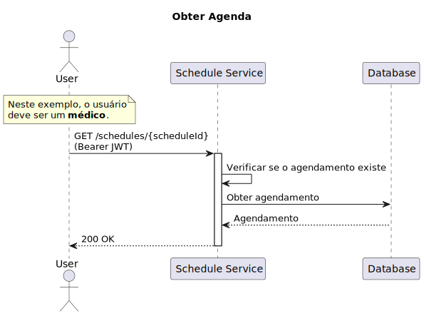
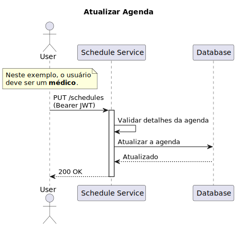
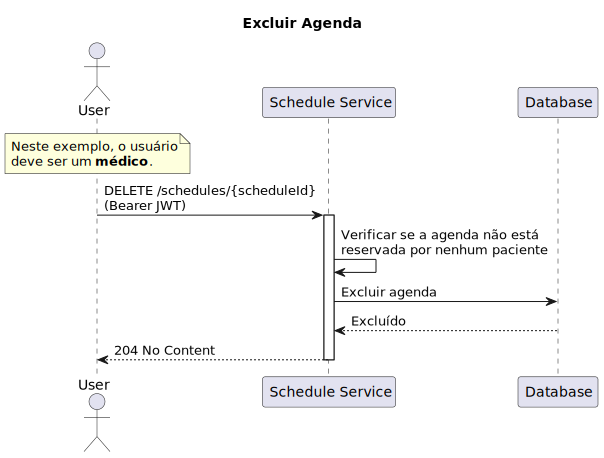

# Scheduler Service

Serviço responsável por gerenciar a agenda médica.

# Desenvolvimento Local

## Requisitos

- [Terraform](https://www.terraform.io/downloads.html)
- [Terraform Docs](https://github.com/terraform-docs/terraform-docs)
- [AWS CLI](https://aws.amazon.com/cli/)

## Implantação manual

### Atenção

Antes de implantar o cluster, certifique-se de definir as variáveis ​​de ambiente `AWS_ACCESS_KEY_ID` e `AWS_SECRET_ACCESS_KEY`.

Esteja ciente de que esse processo levará alguns minutos (~4 minutos) para ser concluído.

Para implantar o cluster manualmente, execute os seguintes comandos em ordem:

```bash
make init
make check # this will execute fmt, validate and plan
make apply
```

Para destruir o cluster, execute o seguinte comando:

```bash
make destroy
```

## Implantação Automatizada

A implantação automatizada é acionada por uma GitHub Action.

# Rotas

| Método | Rota                      | Descrição               | Papel do Usuário |
| ------ | ------------------------- | ----------------------- | ---------------- |
| GET    | `/schedules`              | Obtém todas as agendas  | Médico           |
| GET    | `/schedules/{scheduleId}` | Obtém uma agenda por ID | Médico           |
| POST   | `/schedules`              | Cria uma agenda         | Médico           |
| PUT    | `/schedules/{scheduleId}` | Atualiza uma agenda     | Médico           |
| DELETE | `/schedules/{scheduleId}` | Exclui uma agenda       | Médico           |

# Diagramas

## Criar Agenda

No diagrama abaixo, podemos ver o fluxo de criar uma nova agenda.


## Obter Agendas

No diagrama abaixo, podemos ver o fluxo de obter todas as agendas.


## Obter Agenda

No diagrama abaixo, podemos ver o fluxo de obter uma agenda.



## Atualizar Agenda

No diagrama abaixo, podemos ver o fluxo de atualizar uma agenda.



## Excluir Agenda

No diagrama abaixo, podemos ver o fluxo de excluir uma agenda.



# Licença

Este projeto é licenciado sob a Licença MIT - veja o arquivo [LICENSE](LICENSE) para detalhes.